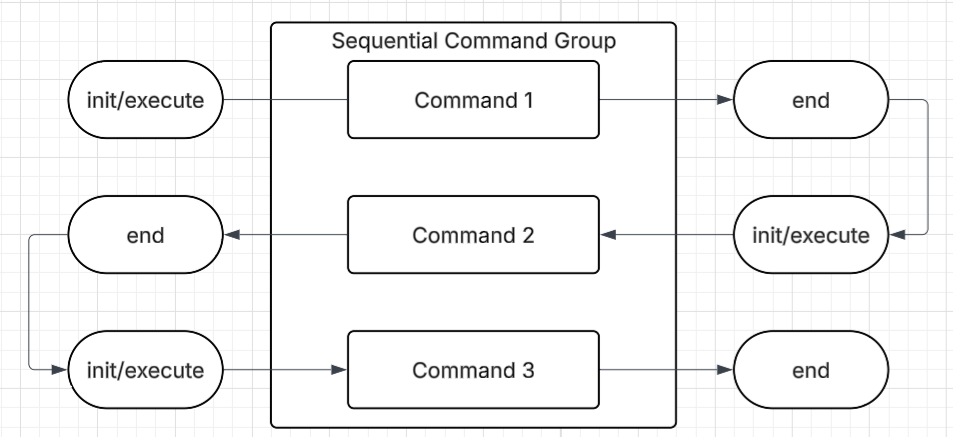
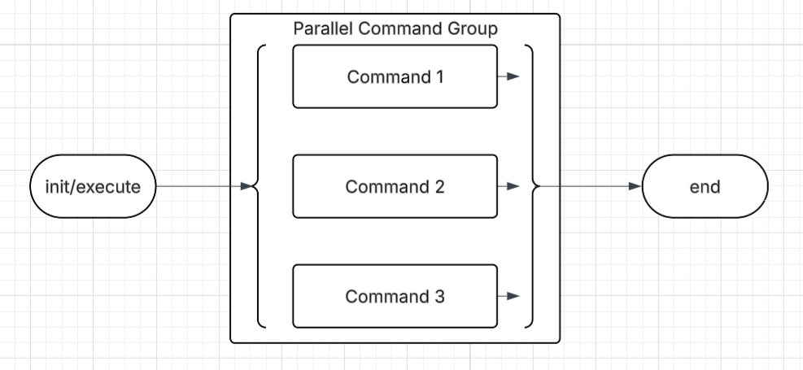

12/02/2025
Today's Goals:
Ian, Antonio, and Philip will be implementing command groups to enable complex autonomous routines.

Today's Tasks:
We are adding command groups (sequential and parallel) to make complex autonomous routines easier by composing simple commands together.

Why Command Groups?

In FRC, WPILib provides command groups that allow teams to build complex autonomous routines by composing simple commands. This pattern has proven incredibly successful in competition robotics because:
- Complex routines are built from tested, simple commands
- Code is more readable and maintainable
- Autonomous sequences can be modified without rewriting everything
- Teams can share and reuse command sequences

We're implementing the same pattern for VEX, following FRC's proven approach.

SequentialCommandGroup:

Runs commands one after another:
```cpp
// Run command1, then when it finishes, run command2, then command3
auto sequence = std::make_unique<SequentialCommandGroup>(
    std::vector<CommandBase*>{&driveForward, &turn90, &intakeGamePiece}
);
```

Use cases:
- Autonomous routines (drive to position, then score, then return)
- Multi-step mechanisms (extend arm, close claw, retract arm)
- Any operation that requires steps in specific order

ParallelCommandGroup:

Runs multiple commands at the same time:
```cpp
// Run drive and intake at the same time
auto parallel = std::make_unique<ParallelCommandGroup>(
    std::vector<CommandBase*>{&driveToGoal, &runIntake}
);
```

Important: Just like in FRC, commands in parallel group cannot use the same subsystem. The scheduler checks this at runtime and will error if there's a conflict. This prevents dangerous situations where two commands try to control the same motor simultaneously.

Implementation Details:

Both command groups inherit from CommandBase, so they can be used anywhere a command is expected. They properly handle requirements by aggregating all requirements from their child commands, ensuring the scheduler knows which subsystems are in use.

The implementation follows FRC's lifecycle pattern exactly:

```cpp
class SequentialCommandGroup : public CommandBase {
private:
    std::vector<CommandBase*> m_commands;
    size_t m_currentIndex = 0;
    
public:
    void initialize() override {
        m_currentIndex = 0;
        if (!m_commands.empty()) {
            m_commands[0]->initialize();  // Start first command
        }
    }
    
    void execute() override {
        if (m_currentIndex < m_commands.size()) {
            m_commands[m_currentIndex]->execute();
            
            // Check if current command finished
            if (m_commands[m_currentIndex]->isFinished()) {
                m_commands[m_currentIndex]->end(false);
                m_currentIndex++;
                
                // Start next command if available
                if (m_currentIndex < m_commands.size()) {
                    m_commands[m_currentIndex]->initialize();
                }
            }
        }
    }
    
    bool isFinished() override {
        return m_currentIndex >= m_commands.size();
    }
};
```

This matches FRC's approach: each command runs through its full lifecycle (initialize → execute loop → end) before the next command begins.

andThen() Decorator:

Added chaining commands, this is a direct port of FRC's andThen() method:

```cpp
// Instead of:
SequentialCommandGroup group({&cmd1, &cmd2, &cmd3});

// You can write (just like in FRC):
cmd1.andThen(&cmd2).andThen(&cmd3);
```

This decorator pattern is widely used in FRC code and makes sequential composition much more readable.

Reflection:
Major milestone achieved! We can now build complex autonomous routines by combining simple commands.  The sequential group walks through commands one at a time, while the parallel group manages multiple commands simultaneously (with proper subsystem conflict checking). The andThen() decorator makes sequential composition even cleaner. These building blocks will make our autonomous programming much more intuitive and maintainable.





12/03/2025

12/06/2025


