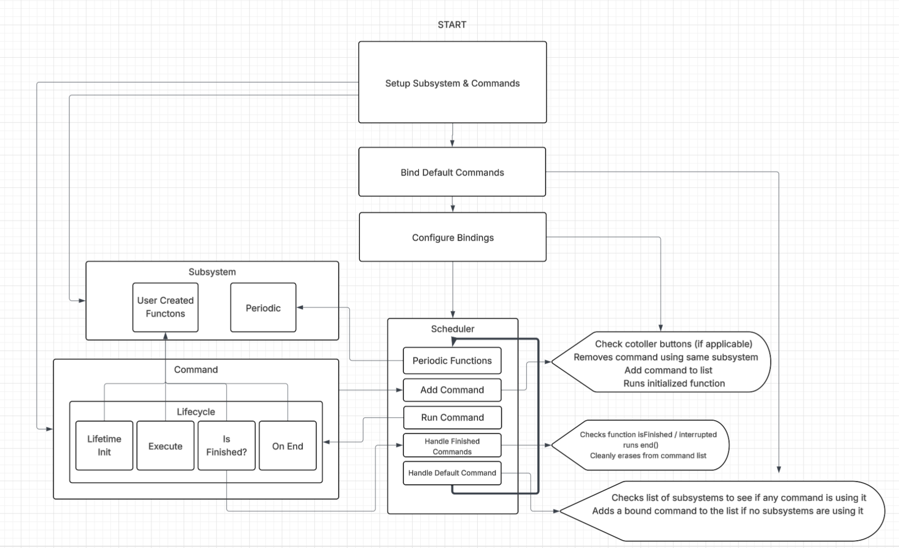

09/09/2025
Today's Goals:
	Ian, Antonio, and Philip will be determining the structure of which our code shall take.

Today's Tasks:
	We are exploring various options of how we want to structure the robot’s code. One style we are discussing is using simple “action” commands that can be called during the robot’s operational routines. 
	Another option we are discussing is utilizing state machines for each physical component of the robot. For instance, we can have a conveyor that runs in these states during the robot’s driver control; "state:running", "state:reversed", and "state:idle".
	We are also discussing the possibility of using a command-based system, based off of FRC WPILib. This combines both the usability of action commands and the modularity of state machines, and creates a modular system that allows for fine-tuned custom procedures as simple or advanced as we desire. 

Reflection:
	We decided that having our framework built on a command-based system would fare the best for the future success of the robot. Upon doing further research on this method, there were little to no examples written for VEX robotics. The command-based architecture is common in FRC (First Robotics Competition) with their WPILib framework, but nothing similar to our knowledge exists for VEX. We realized we would need to build our own command-based framework from scratch, adapting FRC concepts to work with PROS and the VEX V5 platform. While this means more upfront work, it will give us a powerful, flexible system tailored specifically to our needs and make our code more maintainable throughout this and future seasons.

09/10/2025
Today's Goals:
	Ian, Antonio, and Philip will be setting up the environment in which we will be doing most of our work. We need to establish a reliable development workflow that supports collaboration and cross-platform development.

Today's Tasks:
	We are setting up a PROS environment where we will be collaborating on the robot's code. PROS is an open-source custom operating system for the Vex V5 Brain that provides a C/C++ development environment. It features an extension for the Visual Studio Code IDE that allows you to interface with the brain to compile and deploy C++ code to an executable program on the brain. 
	
	Key features that make PROS ideal for our needs:
	- Cross-platform support (Windows, Mac, Linux) - team members can develop on any operating system
	- Built-in debugging tools including serial output and real-time terminal monitoring
	- Integration with Git for version control and collaboration
	- Support for external libraries like LemLib (motion control)
	- Command-line interface for automation and build scripts
	
	We created our initial project structure with the basic PROS template, which includes:
	- `include/` folder for header files (.h)
	- `src/` folder for implementation files (.cpp)
	- `firmware/` folder for the PROS kernel and libraries
	- `Makefile` for building and deploying the project
	
	The project was initialized in the `Test2025/command_test` directory, establishing our workspace for framework development.

Reflection:
	We successfully set up our PROS project for our example-code and pushed it to our repository on GitHub for easy collaboration. A V5 brain was configured for use with PROS and is able to run our compiled project. Team members verified they could clone the repository, build the project, and upload to the brain from their own machines. This cross-platform capability will be essential as we develop the framework over the coming weeks.

**[PHOTO NEEDED: Screenshot of VS Code with PROS extension showing project structure]**
**[PHOTO NEEDED: Terminal output showing successful project compilation and upload to brain]**

09/13/2025
Today's Goals:
	Ian, Antonio, and Philip will be designing the core architecture of our command-based framework. We need to define the three fundamental components: Scheduler, Commands, and Subsystems, and understand how they interact with each other.

Today's Tasks:
	We are laying the foundation for our command-based framework by defining its three main components. A command-based system is built around these interconnected parts:
	
	Scheduler:
	The Scheduler is the core system that manages when and how commands run. It continuously updates every robot cycle (about 20 milliseconds), starting new commands, running active ones, and stopping those that are finished or interrupted. It also ensures that only one command controls a defined subsystem at a time, preventing conflicts. When no command is using a subsystem, the scheduler automatically runs that subsystem's defined default command.
	
	Commands:
	A command is a small block of code designed to perform one specific task, such as driving, controlling pneumatics, or running an intake. Commands are scheduled by controller input or autonomous routines, and the scheduler manages their full lifecycle. The lifecycle has four main stages:
	- `initialize()` - runs once to set up variables and prepare the command
	- `execute()` - runs continuously while the command is active
	- `isFinished()` - checked each cycle to determine when the command should end
	- `end()` - runs once when the command finishes or is interrupted to safely stop hardware and clean up
	
	Subsystems:
	A subsystem represents a physical part of the robot, like the drivetrain or intake. Subsystems contain the basic actions and hardware control logic that commands rely on. Each subsystem has the ability to be controlled by only one command at a time, ensuring safe and predictable robot behavior.
	
	We spent time drawing diagrams showing how these components interact:
	1. User presses button on controller
	2. Controller binding tells Scheduler to start a command
	3. Scheduler checks if the command's required subsystem is available
	4. If another command is using that subsystem, the old command is interrupted
	5. New command starts: `initialize()` runs once
	6. Every loop: `execute()` runs, then `isFinished()` is checked
	7. When finished: `end()` runs, command is removed from scheduler
	8. Subsystem becomes available for other commands (or runs its default command)

Reflection:
	We completed the architectural design for our command-based framework. This week's work focused on designing these three core components so the rest of the season's programming has a clean, organized structure to build on. By establishing clear responsibilities for each component and defining how they communicate, we've created a solid foundation that will make the actual implementation much more straightforward. Next week we'll begin implementing these designs in C++ code.

