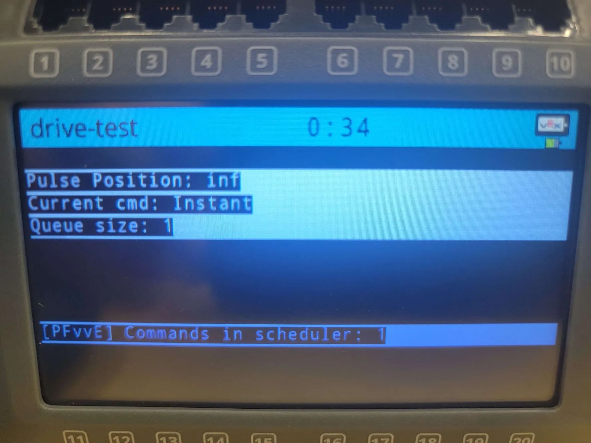

10/07/2025
Today's Goals:
	Ian, Antonio, and Philip will be continuing to add debugging information to the controller screen to help monitor robot behavior during testing.

Today's Tasks:
	We are trying to add more detailed debugging information to the controller screen. We want to display multiple values like seconds elapsed and pulse count, but we ran into a issue where multiple lines fail to display properly.
	
	The Problem:
	We tried to print multiple lines to the controller screen:
	
```cpp
// What we tried - doesn't work!
int count = 5;
int countPulse = 3;

controller->print(0, 0, "Seconds: %d", count);
controller->print(1, 0, "Pulse: %d", countPulse);  // This line doesn't appear!
```
	
	Expected output on controller:
	-------------
	|Seconds: 5	|
	|Pulse: 3	|
	-------------
	
	Actual output on controller:
	-------------
	|Seconds: 5	|
	|			|
	-------------
	
	Only the first line appears! The second `print()` call seems to be completely ignored.
	
	Initial Investigation:
	We added debug code to track print failures:
	
```cpp
printf("Debug: count=%d, countPulse=%d\n", count, countPulse);
int result1 = controller->print(0, 0, "Seconds: %d", count);
int result2 = controller->print(1, 0, "Pulse: %d", countPulse);
printf("Print results: line0=%d, line1=%d\n", result1, result2);
```
	
	The terminal output showed something strange:
	```
	Debug: count=5, countPulse=3
	Print results: line0=1, line1=2147483647
	```
	
	`result2` is returning a huge garbage number (2147483647), which suggests the API call is failing completely. But why?
	
	Reaching Out for Help:
	After several hours of being stuck, we reached out to the LemLib Discord community. A team member from 781X (Andrew) explained something we didn't know about the controller:
	
	The Root Cause - Message Queue:
	
	The VEX V5 controller has a message queue system:
	- Messages to the controller (prints, rumble) are sent every 50ms
	- Only one message can be queued at a time
	- If you try to send a message while one is already queued, the new message is dropped
	
	So when we call:
	```cpp
	controller->print(0, 0, "Seconds: %d", count);  // Queued
	controller->print(1, 0, "Pulse: %d", countPulse);  // DROPPED - queue is full!
	```
	
	The first print gets queued, but the second print happens microseconds later while the first is still waiting to be sent, so it gets discarded!
	
	Trying to Fix It - First Attempt:
	Andrew suggested adding delays between prints:
	
```cpp
printf("Debug: count=%d, countPulse=%d\n", count, countPulse);
int result1 = controller->print(0, 0, "Seconds: %d", count);
pros::delay(50);  // Wait for message to send
int result2 = controller->print(1, 0, "Pulse: %d", countPulse);
printf("Print results: line0=%d, line1=%d\n", result1, result2);
```
	
	Terminal output:
	```
	Debug: count=0, countPulse=0
	Print results: line0=2147483647, line1=1
	Debug: count=1, countPulse=0
	Print results: line0=1, line1=1
	Debug: count=2, countPulse=7
	Print results: line0=1, line1=1
	Debug: count=4, countPulse=7
	Print results: line0=1, line1=1
	Debug: count=4, countPulse=8
	Print results: line0=2147483647, line1=1
	```
	
	It's better, but still failing sometimes! Even with the 50ms delay, we occasionally get failures. We tried increasing to 100ms, 150ms, 200ms - still occasionally fails!
	
	The Real Solution:
	Andrew mentioned we need delays after both prints:
	
```cpp
// FINALLY WORKS!
bool result1 = controller->print(0, 0, "Seconds: %d", count);
pros::delay(50);  // Wait for first message to send
bool result2 = controller->print(1, 0, "Pulse: %d", countPulse);
pros::delay(50);  // Wait for second message to send before doing anything else
```
	
	The key insight: if our code runs in a loop and we print again on the next iteration before the previous messages have been sent, they still get dropped! We need to wait after ALL prints, not just between them.
	
	Also, we switched from `int` to `bool` for the return type - PROS returns 1 for success (which becomes `true`), not 0.
	
	Understanding the 50ms Wait:
	The controller processes messages at 20Hz (20 times per second):
	- 1000ms / 20 = 50ms per message
	- Waiting 50ms guarantees the message has been sent before we queue the next one

Reflection:
	After hours of debugging and help from the community, we finally understand the controller's message queue system! This discovery has led us to create a custom print handler that manages the message queue automatically. Reaching out to the LemLib community saved us from days of frustration. We're grateful to Andrew from 781X for explaining how the controller message queue actually works.


10/08/2025
Today's Goals:
	Ian, Antonio, and Philip will be creating custom print utilities to make printing more reliable and easier to use.

Today's Tasks:
	Instead of having developers manually manage delays between controller prints, we decided to create utility functions in our `customPrint` namespace. We also realized we should differentiate between the V5 brain screen and the controller screen.
	
	The Solution - Custom Print Utilities:
	
	We created a `print.h` header with utility functions for different types of printing:
	
```cpp
// print.h
namespace customPrint {
    // Print to console (serial / RTT)
    inline void printf(const char* fmt, ...) {
        char buf[256];
        va_list args;
        va_start(args, fmt);
        vsnprintf(buf, sizeof(buf), fmt, args);
        va_end(args);
        ::printf("%s", buf);
    }
    
    // Clear a line on the V5 brain screen
    inline void clearScreen(int line) {
        int y = line * 20;  // Approximate line height
        pros::screen::set_eraser(pros::Color::black);
        pros::screen::fill_rect(0, y, 480, y + 20);
    }
    
    // Print to the V5 brain screen at a specific line
    inline void screenPrint(int line, const char* fmt, ...) {
        clearScreen(line);  // Clear the line first to prevent overlap
        char buf[128];
        va_list args;
        va_start(args, fmt);
        vsnprintf(buf, sizeof(buf), fmt, args);
        va_end(args);
        pros::screen::print(pros::E_TEXT_MEDIUM, line, "%s", buf);
    }
}
```
	
	Key Features:
	
	1. printf() - Console printing with proper formatting
	   - Formats the string in a buffer first
	   - Sends to terminal/serial output
	   - Useful for debugging that doesn't affect robot performance
	
	2. clearScreen() - Clears a specific line on the V5 brain screen
	   - Calculates Y position based on line number
	   - Draws black rectangle to erase old text
	   - Prevents text overlap from previous prints
	
	3. screenPrint() - Prints to V5 brain screen with automatic clearing
	   - Clears the line first (prevents ghosting)
	   - Formats the string
	   - Prints to the specified line
	
	Why This Works:
	
	The V5 brain screen doesn't have the same message queue limitations as the controller! We realized we were mixing up two different problems:
	- Controller screen - Has strict message queue (50ms between prints required)
	- Brain screen - No message queue, but text overlaps if not cleared first
	
	Our utility solves the brain screen problem by clearing before printing. For controller prints, we just need to remember to add delays manually when needed, since controller prints are less frequent in our code.
	
	Usage Examples:
	
```cpp
// Console debugging
customPrint::printf("Motor temp: %d\n", motor.get_temperature());

// Brain screen display - automatically clears line first
customPrint::screenPrint(0, "Battery: %.1fV", pros::battery::get_voltage() / 1000.0);
customPrint::screenPrint(1, "Temp: %dC", motor.get_temperature());
customPrint::screenPrint(2, "Time: %d", pros::millis());

// No overlap, clean display!
```
	
	Testing Results:
	
	- Brain screen displays multiple lines clearly without overlap
	- Printf to console works for debugging
	- Simple API - just call the function, no manual clearing needed
	- Works consistently across all our projects

Reflection:
	We created custom print utilities that solve our printing issues! The key insight was realizing we were conflating two different problems: controller message queue limitations and brain screen text overlap. By creating separate utilities for each use case, we have clean, reliable printing throughout our codebase. The `clearScreen()` function before printing prevents text ghosting, and the inline functions keep overhead minimal. 
	
	After this experience, we decided that the brain screen and serial output are more reliable than the controller screen for debugging purposes. The controller's message queue limitations make it less suitable for displaying real-time debug information. For now, we'll focus on using the brain screen and console output for debugging. We have plans to revisit the controller screen implementation later if we need driver-facing information, but for development and testing, the brain screen utilities work great.


