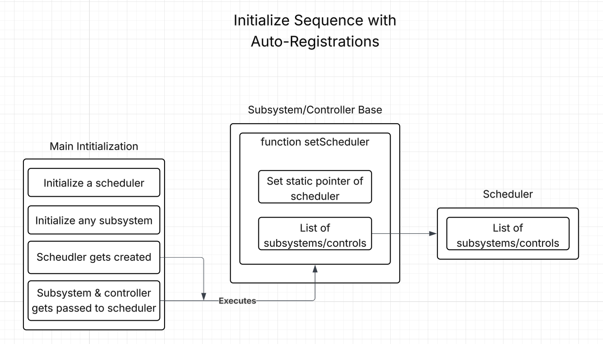

10/21/2025
Today's Goals:
    Ian, Antonio, and Philip will be fixing critical architectural issues with the controller-scheduler relationship and preparing to implement production robot code.

Today's Tasks:
    We discovered and fixed a major architectural flaw in how the controller and scheduler interact. This became critical as we started implementing actual robot subsystems (intake, outtake) for competition.

The Problem - Controller Dependency Issue:

    The controller had a member variable `Scheduler* m_scheduler` that created a circular dependency:
    - Controller needed scheduler pointer to schedule commands from button presses
    - Scheduler needed controller pointer to poll for button inputs
    - When constructing global objects, the initialization order caused crashes

```cpp
// OLD BROKEN APPROACH:
class Controller {
    Scheduler* m_scheduler;  // Each controller has its own scheduler pointer
};

// In robot.cpp - CRASH! Controller constructed before scheduler exists
Controller controller(MASTER);  
Scheduler scheduler;
```

The Solution - Static Global Scheduler Reference:

Changed from instance member to static class member, using deferred registration pattern:

```cpp
// NEW WORKING APPROACH:
class Controller {
    static Scheduler* m_globalScheduler;  // Shared global reference
    static std::vector<Controller*> m_pendingControllers;  // Queue for early controllers
};

// In robot.cpp - Controllers queue themselves
Controller controller(MASTER);  // Adds self to pending list

// In main.cpp initialize() - Registers all pending controllers
void initialize() {
    SubsystemBase::setScheduler(&Scheduler::getInstance());
    Controller::setScheduler(&Scheduler::getInstance());  // Registers pending controllers
    
    robotInit();
    configureBindings();
}
```

Key Changes:
1. Removed `m_scheduler` instance member from Controller
2. Added static `m_globalScheduler` shared by all controllers
3. Added `m_pendingControllers` vector to queue controllers created before scheduler
4. Controller constructor checks if scheduler exists, otherwise queues itself
5. `Controller::setScheduler(&Scheduler::getInstance())` in initialize() registers all pending controllers
6. Uses singleton pattern `Scheduler::getInstance()` instead of global scheduler variable

This allows controllers to be constructed as globals safely, with registration happening in initialize() when `Controller::setScheduler()` is called with the singleton scheduler instance.

Moving Files to custom/ Directory:

Also cleaned up project structure by moving implementation files:
- `src/controller.cpp` → `src/custom/controller.cpp`
- `src/scheduler.cpp` → `src/custom/scheduler.cpp`  
- `src/subsystemBase.cpp` → `src/custom/subsystemBase.cpp`

This mirrors the include structure and clearly separates our framework from PROS/LemLib code.

Reflection:
This was a critical architectural fix that unblocked us from writing real robot code. The circular dependency between controller and scheduler was causing initialization crashes. By switching to a static global scheduler reference with deferred registration, we solved the global object initialization order problem elegantly. Controllers can now be declared globally and will automatically register themselves when the scheduler is created, regardless of construction order. This pattern is essential for our framework to work reliably across different robot projects.


10/22/2025
Today's Goals:
Ian, Antonio, and Philip will be applying the same deferred registration pattern to subsystems to complete the auto-registration architecture.

Today's Tasks:
After successfully fixing the controller registration issue yesterday, we realized subsystems have the same problem. Subsystems also need to register with the scheduler, and they're also constructed as globals. We need to apply the same solution.

Subsystem Auto-Registration:

Applied the exact same pattern we used for controllers to subsystems:

```cpp
// SubsystemBase with auto-registration
class SubsystemBase {
    static Scheduler* m_globalScheduler;  // Shared global reference
    static std::vector<SubsystemBase*> m_pendingSubsystems;  // Queue for early subsystems
    
public:
    SubsystemBase();  // Constructor adds to pending list
    static void setScheduler(Scheduler* sch);  // Registers all pending
    static void registerPendingSubsystems();
};

// In subsystemBase.cpp
SubsystemBase::SubsystemBase() {
    if (m_globalScheduler != nullptr) {
        m_globalScheduler->registerSubsystem(this);
    } else {
        m_pendingSubsystems.push_back(this);
    }
}
```

Complete initialize() Setup:

Now both controllers and subsystems auto-register:

```cpp
// In main.cpp initialize() - Framework setup
void initialize() {
    // Register all globally constructed subsystems and controllers
    SubsystemBase::setScheduler(&Scheduler::getInstance());
    Controller::setScheduler(&Scheduler::getInstance());

    ...
    
    robotInit();        // User initialization
    configureBindings(); // Setup button bindings
}
```

Why This Matters:

This completes our framework's initialization architecture:
1. Construction Phase: Subsystems and controllers constructed as globals, queue themselves
2. Registration Phase: `initialize()` calls `setScheduler()`, all pending objects register
3. Operation Phase: Scheduler can now poll controllers and update subsystems

This means users can write:
```cpp
// In robot.cpp - All of these auto-register!
Controller controller(MASTER);
std::unique_ptr<DriveSubsystem> driveSub = std::make_unique<DriveSubsystem>();
std::unique_ptr<IntakeSubsystem> intakeSub = std::make_unique<IntakeSubsystem>();
```

No manual `scheduler.register()` calls needed - the framework handles it automatically.

Reflection:
Completed the auto-registration architecture for both controllers and subsystems. This makes the framework much more user-friendly - subsystems and controllers automatically register themselves without requiring manual setup code. The deferred registration pattern also solves the C++ global object initialization order problem. Both subsystems and controllers work identically now, making the framework consistent and predictable.




